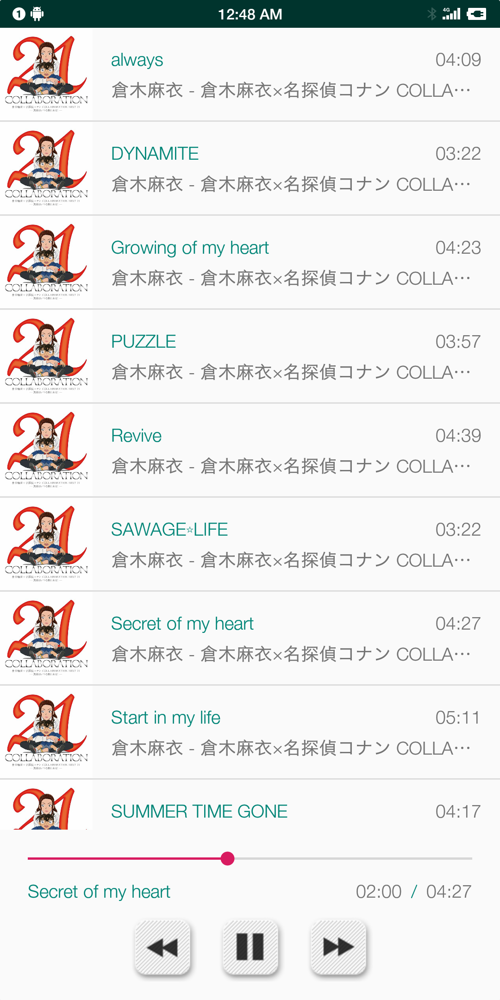
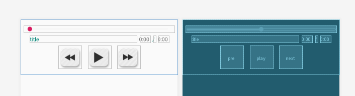

# MyMusic

这个项目写的真的头疼，虽然实际敲码时间应该是没超过30小时。写是写完了就谈一谈时间花在哪儿了。

<div align="center">
    
</div>


## ConstraintLayout 

这个是好东西，LinearLayout也就用过两次，之后全部都是用的约束布局，虽然调整起来有些麻烦，但这是新东西要重视。

<div align="center">
    
</div>

## RecyclerView

这玩意儿灵活性高（意思就是啥都没有，请你自己弄，看透了）

## AudioFocus

音频焦点，就是别人想要放歌的时候会通知你，你自己就别放了，不会同时有两个声音。

写这个东西是因为，看到了[Best practices in media playback - Google I/O 2016](https://www.youtube.com/watch?v=iIKxyDRjecU)，真就2016PPT里将的代码在2017安卓N出来的时候弃用了呗。

其中还有ACTION_AUDIO_BECOMING_NOISY，举个例子就是拔掉耳机暂停的处理。

## Trick

通过变量isDragging，每秒更新进度条的时候如果用户在拖动进度条就不用更新啦。

## Pity

这玩意儿就是在啥都不懂的情况写的，但是凭我我玩了这么多年手机的经验。

想一想就有这些地方可以提升

- 旧的API的适配，因为不想用任何一个已经弃用的API，最小SDK版本直接拉到API26，代码里的写法很多也是安卓N之后的写法
- 有关权限的管理，连安卓那个申请权限的弹窗都没看到，想整一个
- 不懂文件描述符，本来尝试传递文件描述符的，应该还是上下文的问题，想懂
- 这一点仍然与文件有关，MediaStore对应的content provider找不到对应的Uri，MediaPlayer设置源的时候也不太懂怎么整，具体就下面这两段

```java
Uri sArtworkUri = Uri.parse("content://media/external/audio/albumart");
Uri albumArtUri = ContentUris.withAppendedId(sArtworkUri, albumId);

try (AssetFileDescriptor assetFileDescriptor = resolver.openAssetFileDescriptor(song.getStreamUri(), readOnlyMode)) {
                mMediaPlayer.setDataSource(assetFileDescriptor);
}
```

- 12/24日的时候用了回调实现的进程间通信，因为也不会message
- 单元测试咋整？